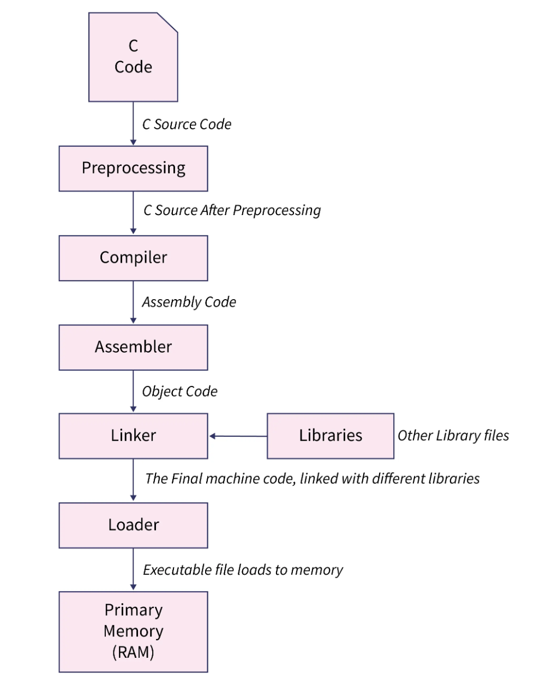

### Introduction

The other day, while drafting a new post for this blog on deriving the speed of light using Maxwell's equations, I had an interesting thought experiment / question. For some background anyone that has used a computer program before (whether it be Google Docs or Ebay or Amazon, etc) knows that it needs some sort of hardware to run on. Even stuff on the "cloud" is not really on the cloud - it's just a gigantic computer in the middle of nowhere Nebraska. Anyways the more important part is that software is grounded and run on hardware. That is, physical machinery. 

Hence, all computations are limited by the laws of physics.  

The semi interesting question (but to me is quite interesting) is whether or not it is possible to conduct a very rudimentary and possibly sacrilegious physics experiment using this fact.

**Can we calculate the speed of light?**

Bear with me: suppose we took some arbitrary computer program, say, written in some low level language like C. And followed the long process below:

  

Then, we timed how long the CPU took to run our code, say, some time unit $$t$$. Lastly, we just need to 

### References

>[Euclid's Theorem Wiki](https://en.wikipedia.org/wiki/Euclid%27s_theorem)
>
>CMU CS 15-251
>
>[arxiv paper](https://doi.org/10.48550/arXiv.2005.10372)
