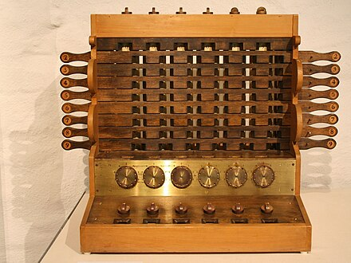

This is going to be a pretty dense post so I've split it up into three parts:

The first post (this one) will talk about computer science as the science of computation and be an introduction to computer science. The second post will talk about a basic "model of computation" (more on that later). Lastly, the third post will talk about "Turing Machines" named after Alan Turing. Feel free to skip around.

### A brief history on computer science

Nowadays, the term "computer" and "laptop" is synonymous, but the field of computer science is not actually the study of "laptops"! Rather, it is the study of computation, algorithms, and information. In general, computer science is a widely applicable field. There's a joke that goes you can add "computational" to anything and it would be a legitimate field of study (i.e. Carnegie Mellon has a computational biology department, but graduate departments elsewhere often have computational physics, computational number theory, computational chemistry, etc). The underlying reason for this is that "mathematics" sets the foundation for the sciences and anything that uses mathematics has some degree of computation to it. Hence computer science is applicable to those fields. An amazing thing about that is that any contribution towards computer science indirectly contributes to countless other fields! 

#### Human computers
While the term "computers" are mostly used in the context of laptops or personal computers, the actual word goes back several hundreds of years. Around the 1600's, "computers" used to be a term given to people who did arithmetic computations. 

  

Similarly, during World War I, the United States, would hire (with men in war) women to work as "computers", calculating ballistic tables, producing map grids. Occupations such as "computers" were fundamental for the war effort. 

#### Mechanical computers

At a similar time as the first human computers were becoming a profession, machines were being created to assist humans with these computations. The first such example was the abacus, and these machines were given the name "calculator". 

  

Fast forward a few centuries and in 1623, we have Wilhelm Schickard who made the first mechanical calculator. 

  

As technology progressed, our ability to compute improved greatly. The average modern day computer can perform about 5 billion calculations PER SECOND!