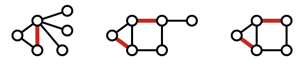

### Introduction
This is the first of three posts that will talk about matchings! 

While the idea of matchings are ubiquitous in many applications, the first part (this post) will cover the details of the Gale-Shapley algorithm. The second post will prove correctness, and the third part (perhaps in an unintuitive order*) will motivate the Gale-Shapley algorithm and focus on the dating app Hinge, that implements Gale-Shapley! (And perhaps some tips?)

*Usually the algorithm is motivated first and then elaborated upon, but it seemed better to me that we talk about the algorithm first and then the motivation because of a key point that requires knowledge about GS first. 
### Prereqs

This article will assume you have at least heard of the following terms - even better if you have some working knowledge with them.

1) Matchings
2) Perfect Matchings

As a refresher, here is an image from wikipedia of matchings:

Pictorally, an example is given below (image from wikipedia):

  

Since it's convenient, I'll also take the definitions for matchings and perfect matchings from wikipedia:

#### Matchings

>Given a graph $$G = (V, E)$$, a matching M in G is a set of pairwise non-adjacent edges, none of which are loops; that is, no two edges share common vertices.

#### Perfect Matchings

>A perfect matching is a matching that matches all vertices of the graph. That is, a matching is perfect if every vertex of the graph is incident to an edge of the matching. 

### Definition(s)

The only definition we now need to cover is a matching called a "stable matching".

Given sets $$A, B$$, a matching $$M$$ between $$A$$ and $$B$$ is considered stable when there does not exist any pair $$(a, b)$$ which both prefer each other to their current partner under the matching $$M$$. Preference is defined under a preference list. That is, for each member of set $$A$$, $$a_i$$, they have a 'preference list' that ranks each member of $$B$$, $$b_i$$, from most to least preferred partner (this order is arbitrary, $$a$$ could have ranked members of $$B$$ from least to most preferred partner, as long as it remains consistent across all members of the sets $$A$$ and $$B$$). Consequently, stable matchings are not defined when $$\text{cardinality}(A) \neq \text{cardinality}(B)$$. 

As an example, suppose the case where $$\text{cardinality}(A) = \text{cardinality}(B) = 3$$. With the following preference lists:

$$p(Kimiko) = [Billy, Hughie, Frenchie]$$

$$p(Maeve) = [Billy, Frenchie, Hughie]$$

$$p(Annie) = [Hughie, Billy, Frenchie]$$

$$p(Billy) = [Annie, Maeve, Kimiko]$$

$$p(Hughie) = [Annie, Kimiko, Maeve]$$

$$p(Frenchie) = [Maeve, Annie, Kimiko]$$

Then, a stable matching for this set could be:

$$(Billy, Maeve), (Hughie, Annie), (Frenchie, Kimiko)$$

Verify for yourself that this is in fact stable. 

On the other hand, the following matching is not stable:

$$(Billy, Maeve), (Hughie, Kimiko), (Frenchie, Annie)$$

The above is simply the same as the stable matching above, except the partners of Hughie and Frenchie are swapped. In this instance, now consider the pairing (Hughie, Annie), which is not matched above. Note that Annie's preference of Hughie is ranked first, so Annie prefers Hughie more than her current match, Frenchie. 

**One sided preferences are still stable.** However, Notice that in this case, Hughie also prefers Annie over his current partner, Kimiko. Since now there exists a pairing where the members of the pairing (in this case (Hughie, Annie)) prefer each other over their current partners, this is an unstable matching!

### The Gale-Shapley Algorithm

To motivate the Gale-Shapley algorithm, read the next post!

Here, we will only lay out the foundations for the algorithm.

Let $$A, B$$ be sets containing members of an organization with $$\text{cardinality}(A) = \text{cardinality}(B)$$. We will show that in a scenario similar to the one above, given preference lists for each member of $$A, B$$, there is an algorithm that ALWAYS returns a stable matching!

This result is sort of unintuitive - it's not immediately obvious if a stable matching always exists. The elegance and importance of such an algorithm comes from the fact that not only can it *find* a perfect matching, one can *always* find a perfect matching. 

As it turns out, such an algorithm is also rather simple. Named after David Gale and Lloyd Shapley, it won Gale (and Alvin E. Roth) an Economics Nobel Prize in 2012. 

Here, for the convenience of notation, $$pref(S)$$ for some set of members $$S$$, will be the preference list of each member of $$S$$. That is:

$$pref(S) = \{p(s) | s \in S \}$$

Also for the sake of easier interpretability, people of set $$A$$ will be guys and set $$B$$ will be girls. 

#### Code

>(1)def $$\text{gale_shapley}(A, B)$$:
>
>(2)&emsp;&emsp;while there exists $$\textbf{guy}_i$$ in $$A$$ that is not matched:
>
>(3)&emsp;&emsp;&emsp;&emsp;let $$\textbf{guy}_i$$ propose to the first $$\textbf{girl}_j$$ in $$B$$ that $$\textbf{guy}_i$$ has not yet proposed to
>
>(4)&emsp;&emsp;&emsp;&emsp;&emsp;&emsp;if $$\textbf{girl}_j$$ is not yet matched:
>
>(5)&emsp;&emsp;&emsp;&emsp;&emsp;&emsp;&emsp;&emsp;match $$(\textbf{guy}_i, \textbf{girl}_j)$$
>
>(6)&emsp;&emsp;&emsp;&emsp;&emsp;&emsp;else:
>
>(7)&emsp;&emsp;&emsp;&emsp;&emsp;&emsp;&emsp;&emsp;that means $$m = (\textbf{guy}_i', \textbf{girl}_j)$$ must be matched / is a pair
>
>(8)&emsp;&emsp;&emsp;&emsp;&emsp;&emsp;&emsp;&emsp;if $$\textbf{girl}_j$$ prefers $$\textbf{guy}_i$$ over $$\textbf{guy}_i'$$:
>
>(9)&emsp;&emsp;&emsp;&emsp;&emsp;&emsp;&emsp;&emsp;### ($$\textbf{guy}_i$$ is higher on her pref list than $$\textbf{guy}_i'$$)
>
>(10)&emsp;&emsp;&emsp;&emsp;&emsp;&emsp;&emsp;&emsp;&emsp;&emsp;match $$(\textbf{girl}_j, \textbf{guy}_i)$$
>
>(11)&emsp;&emsp;&emsp;&emsp;&emsp;&emsp;&emsp;&emsp;&emsp;&emsp;unmatch $$\textbf{guy}_i'$$ (i.e, he now has no partner)
>
>(12)&emsp;&emsp;&emsp;&emsp;&emsp;&emsp;&emsp;&emsp;else:
>
>(13)&emsp;&emsp;&emsp;&emsp;&emsp;&emsp;&emsp;&emsp;&emsp;&emsp;keep $$(\textbf{girl}_j, \textbf{guy}_i')$$ matched
>
>(14)&emsp;&emsp;return all matches

#### Main properties

The Gale-Shapley algorithm guarantees the following 3 important properties:

1) All members are matched

2) All matchings are stable

3) The algorithm is polynomial time

### Overview

It's surprising that a simple algorithm like the one above can solve the stable matching problem - and to the extent that it does! It guarantees all members are matched, that all matchings are stable, and even that the algorithm runs in poly time! (Which is fast)

The next post will cover the proofs as well as some applications!

### References

>[Stable Matchings Wiki](https://en.wikipedia.org/wiki/Stable_marriage_problem)
>
>[Gale-Shapley Algorithm Wiki](https://en.wikipedia.org/wiki/Gale%E2%80%93Shapley_algorithm)

