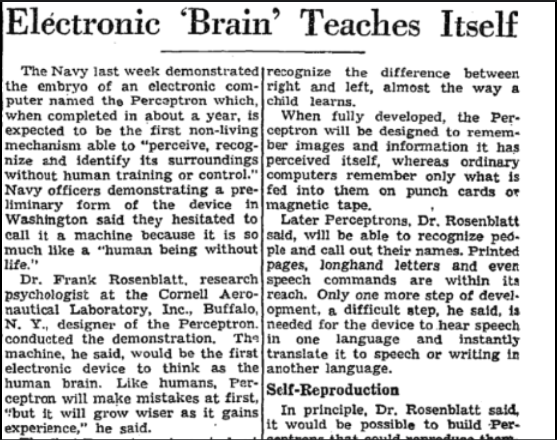
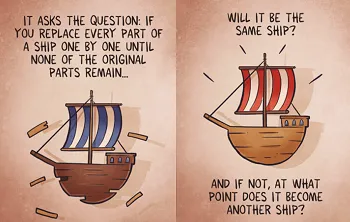

### Introduction
In the mid 1900s, the theory of an 'artificial' intelligence began gaining recognition. Scientists wanted to model the human brain and investigate a theory of learning and consciousness. Among the pioneers of an 'artificial' intelligence was Frank Rosenblatt, who, in 1957, created Mark 1 Perceptron (M1P). His machine was modeled after the biology of a human eye: receptors, neurons, and the like, and is the first worked example of computational connectivity. 

  

However, perhaps out of overconfidence in his work, or a feeling of premature accomplishment, Rosenblatt frequently talked with various reporters, calling his M1P a machine capable of being "**conscious of its own existence**".

He argued that the Perceptron would be able to "make mistakes at first...but [grow wiser with experience]".

Rosenblatt's ambitions for his machine were high, but unfortunately, those expectations fell short as people realized that his machine was not computationally powerful enough to do the aforementioned, effectively slowing down research in connectionist theory (a theory that modelled the brain as various connections).

Today, however, we have begun to see a **new** 'artificial' intelligence revolution: one that has its foundations in the ideas of the perception and connectionist theory. 

The focus of this article, however, is a thought experiment on consciousness, intelligence, and existence.

### On consciousness
Humans like to think of consciousness as the property of something being self-aware of their own existence. A subset of recorded history contains countless debates of the definition of consciousness, the state of being conscious, and the overlapping ideas within. 

However, to me, and the focus of this article, is the question of whether we can prove something to have consciousness or not. This question has very obvious implications to the definition of being a "persons" as defined by law - and for our future that will be intricately tied with an 'artificial' intelligence (whatever it might be), we should be able to argue what makes something a "person". 

#### A thought experiment (1)
One thought experiment goes like such: What if I am the only conscious being? Equivalently, is everyone else a "zombie"?

Heuristically, we argue no: I am conscious (*), my peers are like me, therefore my peers are conscious. 

To me, this argument is satisfactory. Here, I'd also like to bring up the point of "defining to satisfaction". That is, I will only try to define or argue things up to the point that it is satisfactory to some sort of standard, rather than perfect or formalized. 

For now, we will base future logic on the following assumption:

>All humans have consciousness: the property of being self aware.

#### I doubt, therefore I think, therefore I am

Famously, René Descartes said in *Principles of Philosophy*, "dubito, ergo sum" / "cogito, ergo sum": "I doubt, therefore I am" / "I think, therefore I am". Later, Antoine Léonard Thomas, in an essay honoring Descartes, said "dubito, ergo cogito, ergo sum": "I doubt, therefore I think, therefore I am".

This sentence summarizes the powerful idea that, at the very least, I (the "self") must exist. That is, there must exist something that can think, something that can doubt, to be able to produce that very thought in the first place, and the "thing" that is doing the doubting and thinking is the "self". Therefore, I, at the very least, must exist. 

### On being human

So what does it mean to be "human"? Perhaps the more motivated question would be, what differentiates "human" from "AGI"?

  

AGI has different definitions depending on who you ask. Most would argue that artificial general intelligence (AGI) is a machine capable of performing a broad range of tasks at the level a human can. Perhaps more importantly is the idea that AGI can generalize their experiences and knowledge to new or uncertain scenarios, much like humans can. 

Suppose then, that AGI exhibits the same behaviors and can do the same skills as humans. What differentiates the two? Biological components vs electrical components? This differentiation is trivial - and speaking purely abstractly, biological components aren't much different from electrical components. 

This reminds me of the *Ship of Theseus* argument: how much of the original ship can you strip away before it stops being the Ship of Theseus?

  

I'd like to use the same thought experiment on what it means to be human.

#### A thought experiment (2)

How much of a human's biological parts can you remove before it stops being human? (Ok, that sounds a little gory, but bare with me)

Amputees are still human, and I'd think a lot of people would agree that every single part of a human body, by itself, is still "human". What differentiates human to human, however, is their genetic material: DNA, as well as their experiences and knowledge. Our own "source code" to say, that validates our existence as being human and being different from the other humans we encounter.

Purely abstractly, one could say the same about a machine that is capable of general intelligence. They have their own "source code" (whether it be neuron weights or architecture: "DNA") as well as experiences / knowledge (learnable weights) that allow them to adapt to their environment. 

**This is why I argue that humans and AGI being differentiable by their biological makeup is trivial.**

**Naturally, this points us to a different idea: consciousness or the state of being conscious.**

Perhaps we can differentiate humans and AGI by their ability (or inability) to be conscious. 

### Humans as functions

In general, it seems reasonable to think of humans as some sort of time-dependent functions.

Recall that for a map to be well defined, it must be defined for all possible inputs, all outputs must exist in the space it is being mapped to, and all inputs should only map to one output.

>Can you guess where humans enter a muddy area when defined as functions?

Yes, it's the third point: all inputs should only map to one output.

For an example, think about Billy, who is frying some eggs on Monday and Tuesday, and on both days, accidently touches the super hot pan! The input to this human algorithm, "touching super hot pan" is the same, but the output: "freaking out and pulling away his hands 0.1 seconds later on a Monday" vs. "freaking out and pulling away his hands 0.2 seconds later on a Tuesday" is different. Hence, humans make ill-defined functions.

However, there is a small loophole you can use to theoretically make the function well-defined: make the input as complex as possible (which humans do). For example, instead of the input being simply "touching super hot pan", it could be "touching super hot pan on Monday when the window was open, the room temperature was 82 F, the outside weather was sunny, and he touched it at an angle of 84.23492 degrees... etc". Clearly, this function would be well defined since it would be difficult to perfectly replicate the conditions in which an event happened. And if the conditions were replicated exactly, it would only dependent on the time part. 

>Formally, something like this: consider $$\mathcal{H}: \mathcal{E} \times \mathcal{S} \times \mathbb{R} \Rightarrow \mathcal{S}$$ being a function that maps all possible events $$\mathcal{E}$$ and input states $$\mathcal{S}$$ and some time $$t \in \mathbb{R}$$ to all possible output states.

This is an obvious oversimplification, but it suffices, or shall I say, it is satisfactory. 

This idea of humans being function also aligns with our intuition as well as what I said earlier about the differentiating factor between humans and AGI being the ability or inability of being conscious. 

Notice that by the definition of function, we actually do not care ***how*** the function is being computed - just that it is. 

Much like how humans have "thoughts" in their head, the AGI analogue might be computing some weights according to some distribution, but regardless, functions as a mathematical object do not care what these thoughts are or what the weights being computed are.

### On being conscious

Remember earlier, that I argued heuristically why, I, to a point of satisfaction, believed that humans are conscious:

>I am conscious (*), my peers are like me, therefore my peers are conscious. 

The previous section argued that humans can be modeled as functions. 

To be a little more formal, let all humans be mapped to a descriptive function. Then, realize a distribution across these functions. Clearly, functions that aren't descriptive to humans will fall outside the distribution, and some humans will be outliers as well.

We refine our previous argument to the following:

>I am conscious (*), **most** of my peers are like me, therefore **most** of my peers are conscious. 

In general, it seems plausible to also assume that AGI could model a descriptive function for a human, as these are, at the end of the day, still functions. (~Some sort of [universal approximation theorem](https://en.wikipedia.org/wiki/Universal_approximation_theorem) for AGI, perhaps?)

This, however, implies the following:

>I am conscious (*), **most** of my peers are like me, AGI is like me, therefore **most** of my peers and AGI are conscious.

