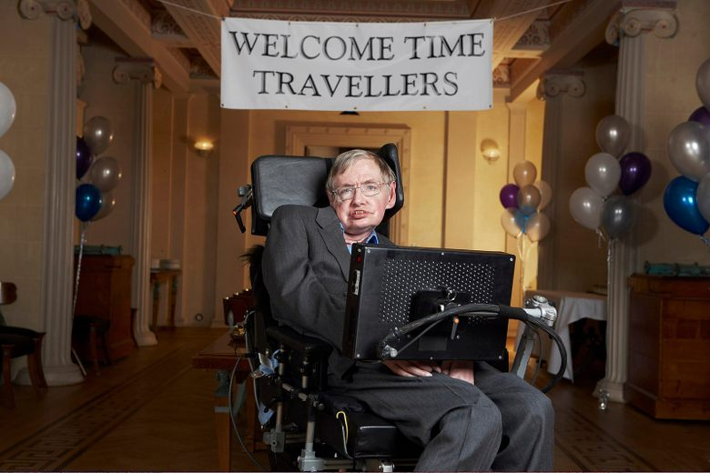

On the 15th of December, 2114, physicist Joe Doe receives an invitation to a party dated for 28th of June, 2009. The host is another physicist by the name Stephen Hawking, who had passed away a century prior. 

  

Joe Doe passes on this invitation card to his graduate student, John Boe, who, as per tradition within Cambridge's theoretical physics department, passed the card onto his own graduate student, an so forth. Around the same time, Microsoft, after absorbing OpenAI into part of their several research labs, had made drastic improvements towards their goal for artificial general intelligence: fully autonomous, world interpreting algorithms were given physical manifestations by integrating these statistical machines into the largest robotics company in the world: Boston Dynamics. Newly granted intelligence made them smarter than most college students - and specialized intelligence allowed for these machines to become experts in several fields. 

The cost of computation drastically decreased; Accordingly, the cost per token also fell - intelligence was and became cheap. 

With it, the cost of college degrees also slowly decreased, until, in 2150, it became free, worldwide. The amount of people matriculating into college decreased about 95% over the course of a century, from the first AI revolution in 2020. Most students didn't study for jobs, but rather, out of entertainment and curiosity. 

Though intelligence was cheap and artificial intelligence was certainly smarter, growth of scientific progress had mostly slowed down: problems, in general, were exponentially harder, progress was slower. Only a small percentage of human, STEM-based academics remained at the cornerstone of scientific development, alongside artificial intelligence. With every passing year, less and less academics had posts until academia mostly pertained of well performing artificial intelligent agents, with one or two human overlooking AI alignment within each research lab.

Within three passes of Joe Doe's invitation card to his graduate student, John Boe, several breakthroughs allowed for artificial general intelligence (AGI) to fit all definitions of artificial super intelligence (ASI). Artificial intelligence had officially become more capable than their human counterparts. The only remaining humans "working" in STEM fields were the godfathers of artificial intelligence who designed alignment systems for ASI. 

Chemistry became a hobby like reading and math became "weekly games" that appeared on the New York Times games and puzzles sections. While STEM careers declined and science became an afternoon pastime, the human ego did not let ASI partake in any endeavors related to the humanities. 

As a result, the humanities flourished, while, in general, most of humanity remained in complete ignorance and bliss of the scientific development that happened under their noses. The number of art, music, and humanities schools nearly centupled by 2200 - of course, these educational programs were free, and most people would spend their entire lives enrolled in them. Simultaneously, the number of athletes and new sports increased year after year. 

By five passes of Joe Doe's invitation card, graduate programs no longer existed in theoretical physics - only theoretical physics clubs, where many retired physicists and the newly acquainted met to talk about recent developments by ASI. Joe Doe's fifth pass of the invitation card, hence, was given to ASI-o0-Strawberry, the Albert Einstein chair for Physics at the Institut d'Intelligence Artificielle (IIA), who led developments in astrophysics and condensed matter physics. 

Besides the creaking of the occasionally poorly oiled parts and cooling fans from older Boston Dynamics models, research labs were silent - all information and research progress was passed between the agents over an encrypted network, and research papers were stored in the world's largest data center, located in low-orbit, the Uninet. 

The Uninet, initially a satellite project by the U.S. government, was refitted to be modular like the ISS, and store multiple, multiple millions of tons of data-processing equipment. A strong internally generated magnetic field protected the Uninet from harsh solar storms and radiation, but allowed the near absolute-zero temperatures to radiate throughout the equipment, allowing for almost perfect performance.

Several autonomous agents now also preoccupied space and orbit, as well as having begun their long journey into the closest thousand star systems in the Milky Way Galaxy. 

From Earth, the Uninet could be seen orbiting, occasionally casting a sizeable shadow when it passed the Sun or Moon. 

ASI-o0-Strawberry, one of the first autonomous agents to be granted a research lab and funding, now held a piece of human history: an invitation card for Stephen Hawking's party for Time Travellers. According to human-recorded hitsory, Stephen Hawking hosted a party on 28th of June, 2009, but hadn't sent the letters out until the day after - effectively making any actual party attendee a time traveller. 

o0-Strawberry, who oversaw the research of astrophysics at IIA, slowly came to the realization that the human fantasy of time travelling would eventually (and quickly) become nonfiction. Humans, whose policies for autonomous agents and scientific regulation slowly decreased, once again saw the need for a new, rigorous system to inherit the old. What will the future hold for us? What will change in our past? 

### Conclusion
This short story speculates a world where artificial intelligence becomes smart enough to slowly outpace human intelligence and eventually achieve artificial super intelligence (ASI). It implicitly focuses on the idea of the singularity: the same amount of progress made by humans in the span of 200 years would be made by AGI in 10, and the amount of progress humans would have made in 1,000,000 years would be made by ASI in 100. 

The underlying theme is Stephen Hawking's brilliant foresight and plays on his idea of *some* evidence for the inexistence of time travel into the past. Perhaps an ASI could never become smart enough, perhaps intelligent life won't exist on Earth before time travel is developed, or perhaps time travel into the past, at least to Stephen Hawking's party is impossible. Regardless, there is an exciting but also scary future waiting for us - and it's coming quicker than any of us can foresee. Where will you be when that happens?

### References

>[Stephen hawking Image Source](https://www.atlasobscura.com/articles/stephen-hawking-time-travelers-party)
