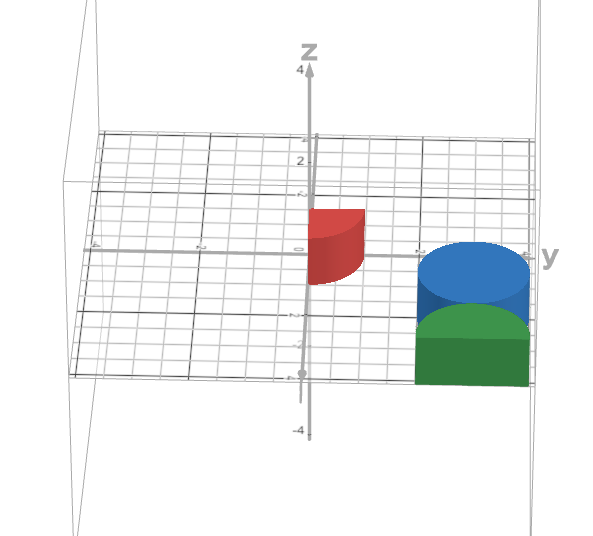

### Introduction
The other day, I got a shirt from Jane Street with this design:

  

For the past few days, I made it my mission to decode what the expression was saying. Here it is in Latex:

$$\lim_{n \to \infty} \mathbb{E}\Bigl[\int_{[0,1]^2}\Bigl(\Bigl(\sum\limits_{i=1}^{n} \mathbb{1}_{B(X_i, r_i)}(x) \Bigr)\text{mod } 2\Bigr)dx\Bigr] $$

$$X_i \sim U(0,1)^2, r_i \sim U\Bigl(0, \sqrt{\frac{3}{n\pi}}\Bigr)$$

Pretty nasty equation, at first glance!

However, there are some things that help us find out what's going on.

### Decoding Notation
**Random Variables**

What I immediately noticed, were the two descriptions for $$X_i$$ and $$r_i$$, respectively. It gave away $$X_i$$ and $$r_i$$ to be random variables!

Specifically, the $$U$$ suggests that they are random variables which are taken uniformly from the sample spaces. $$X_i$$ is sampled uniformly from the unit square, and $$r_i$$ is sampled from the real line from $$0$$ to $$\sqrt{\frac{3}{n\pi}}$$.

This also aligns with the Expectation symbol, $$\mathbb{E}$$!

**Indicator Variables**

The next thing I noticed was the boldface $$\mathbb{1}$$, which, in the context of probability, could only mean an indicator variable! 

**Balls**

From the naming of $$X_i$$ and $$r_i$$, we can reasonably deduce that $$B(X_i, r_i)$$ which is the subscript of the bolded $$\mathbb{1}$$, might be referring to a shaded circle $$c_i \subset \mathbb{R}^2$$, centered at some $$x = X_i$$, with radius $$r = r_i$$. 

The notation was a little ambiguous for my preference, but since the integral is being taken over a subset of $$\mathcal{R}^2$$, the variable $$x$$ is actually the coordinate pair that uniquely defines points in $$\mathcal{R}^2$$. 

This conveniently aligns with the above definitions for Indicator Variables and Balls!

That is, 

$$\mathbb{1}_{B(X_i,r_i)}(x) = \begin{cases}
1 & \text{if } x \text{ is within the closed ball }  B(X_i, r_i),\\
0  & \text{otherwise},\\
\end{cases}$$

### Finding a Solution
The hope is to evaluate the above expression. With the notation out of the way, we have a better idea of what it could all mean. 

Recall that expected value can only be taken for a random variable. 

Hence, the value of the integral is defined by a random variable, which we will call $$V$$. 

That is:

$$V = \int_{[0,1]^2}\Bigl(\Bigl(\sum\limits_{i=1}^{n} \mathbb{1}_{B(X_i, r_i)}(x) \Bigr)\text{mod } 2\Bigr)dx$$

$$X_i \sim U(0,1)^2, r_i \sim U\Bigl(0, \sqrt{\frac{3}{n\pi}}\Bigr)$$

First, let's try decomposing this into some smaller parts. 

Here are some "small" bits and pieces:

1. The integral is over the unit square with corners at the origin and $$(1,1)$$
2. The ball is random, but must its center must always be inside the unit square
3. The radius is w.r.t $$n$$, but as $$n$$ approaches infinity, we will have $$0$$ radius. Otherwise, it seems pretty arbitrary. 

Recall the indicator variable definiton we had above:

$$\mathbb{1}_{B(X_i,r_i)}(x) = \begin{cases}
1 & \text{if } x \text{ is within the closed ball }  B(X_i, r_i),\\
0  & \text{otherwise},\\
\end{cases}$$

We're going to make a small substitution so that all the integration makes more intuitive sense. Let $$f(x) = (\sum\limits_{i=1}^{n}\mathbb{1}_{B(X_i, r_i)}(x) \text{ mod } 2)$$.

Under this substitution (and putting it in double integral form), we have:

$$\mathbb{E}\Bigl[\int\limits_0^1\int\limits_0^1f((x,y)) dxdy\Bigr] $$

Remember that intuitively, the integral is simply the area under the curve of the function we are integrating. For functions of two variables, that would be the volume under the surface. 

Interestingly, our function has some unique properties:

$$f(x,y) = \begin{cases}
1 & \text{if }  (x,y) \text{ is covered by an odd number of balls },\\
0  & \text{otherwise},\\
\end{cases}$$

**What does this mean for our integral?**

Well, first, the integral is $$0$$ for whatever region $$\Omega$$ is not covered by an odd number of balls. This is because of the modulus operand.

Since the indicator variable evaluates to $$1$$ in these cases, what the function looks like are basically "elevated circles" in the unit square like so (This isn't actually graphed in the unit square, so just pretend like it is :P): 

  

There are some key takeaways here:

1. Not all balls are "complete": this is because we are truncating outside of the unit square
2. Some balls can overlap / touch: not pictured, but yes, the balls can overlap since the balls are independently sampled. However, only the regions where an odd number of balls overlap will be shown!

In fact, these balls are exactly the design on the shirt! Here's the shirt again for reference:

  

Notice the orange regions are where there is an odd number of balls overlapping, and blue regions are even number of balls. Since $$0$$ is even, most of the region is blue!

Now, recall that the "volume" of a cylinder is $$\pi * r^2 * h$$, where $$h$$ is height and $$r$$ is radius. However, for the special case $$h=1$$, the volume is equivalent to the area of a ball! 

$$\int\limits_0^1\int\limits_0^1f(x,y) dxdy= \text{ the area of all balls in the event that the number of ball coverings is odd}$$

And thus:

$$\mathbb{E}\Bigl[\int\limits_0^1\int\limits_0^1f(x,y) dxdy\Bigr ] = \text{ the expected area of regions covered by an odd number of balls}$$

Using the linearity of expectation:

$$\mathbb{E}\Bigl[\int\limits_0^1\int\limits_0^1f(x,y) dxdy\Bigr ] = \mathbb\int\limits_0^1\int\limits_0^1\mathbb{E}\Bigl[f(x,y)\Bigr] dxdy$$

And using the probability of a indicator random variable (which says that $$\mathbb{E}(\mathbb{I}_\textbf{E}) = \mathbb{P}(E)$$):

$$\Bigl[\mathbb\int\limits_0^1\int\limits_0^1\mathbb{E}\Bigl[\Bigl(\sum\limits_{i=1}^{n}\mathbb{1}_{B(X_i, r_i)}(x) \text{ mod } 2 \Bigr)= 1\Bigr] = \mathbb\int\limits_0^1\int\limits_0^1\mathbb{P}\Bigl[\Bigl(\sum\limits_{i=1}^{n}\mathbb{1}_{B(X_i, r_i)}(x) \text{ mod } 2 \Bigr)= 1\Bigr] dxdy$$

### Conclusion
At this point, I've realized that finding a numerical solution to this problem likely won't lead to any interesting insights... the most interesting connection was how the design could have been constructed! A random process fully describes the design on Jane Street's shirt! Case closed.

### References

>[The guy on github that gave me a hamlet txt file](https://gist.github.com/provpup/2fc41686eab7400b796b#file-hamlet-txt)
>
>[The guy on reddit discovering infinity](https://www.reddit.com/r/Existentialism/comments/16hcfi6/no_fucking_chance_would_infinite_monkeys_with/)
